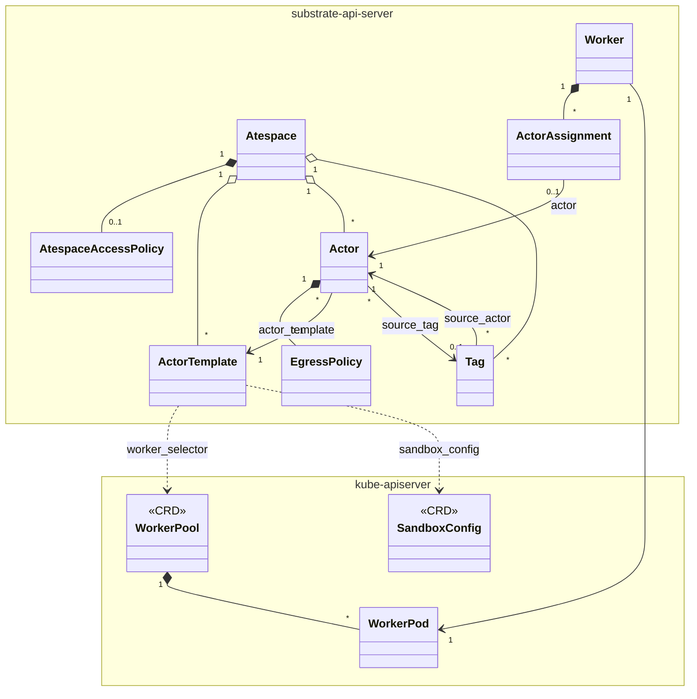

# Substrate Resource Model

Substrate exposes resources through two APIs:

- a **gRPC API** (`pkg/proto/ateapipb/ateapi.proto`), served by the
  Substrate API server. Its resources follow the
  [API Style Guide](api-style-guide.md).
- The **Kubernetes API**, through CRDs in `pkg/api/v1alpha1`, for
  managing compute infrastructure. Its resources follow the
  [Kubernetes API conventions](https://github.com/kubernetes/community/blob/main/contributors/devel/sig-architecture/api-conventions.md)

## Scope and parent

Every resource belongs either to the whole Substrate installation or to a
single atespace. A **global** resource, such as an `Atespace` or a `Worker`,
belongs to the whole Substrate installation. An **atespace-scoped** resource,
such as an `Actor` or a `Tag`, belongs to one atespace, and atespaces keep
their resources apart from each other.

Some resources exist only as part of another resource. These are
**subresources**, and the resource they belong to is their **parent**. For
example, an `EgressPolicy` is part of an `Actor`. A subresource is always
reached through its parent and goes away when its parent does.

A subresource's parent can also be **Global**, which stands for the whole
Substrate installation. Global is not a resource. It is the root of the
hierarchy below.

## Hierarchy

```
Global
├── AccessPolicy "default"         subresource (singleton)
├── Atespace
│   ├── AccessPolicy "default"     subresource (singleton)
│   ├── ActorTemplate
│   ├── Actor
│   │   └── EgressPolicy "default" subresource (singleton)
│   └── Tag
└── Worker
    └── ActorAssignment            subresource (one per hosted Actor, managed by Substrate)
```

## Top-level resources

| Resource | Scope | Cardinality | Written by |
| :--- | :--- | :--- | :--- |
| `Atespace` | Global | 0..N | Clients |
| `ActorTemplate` | Atespace | 0..N | Clients |
| `Actor` | Atespace | 0..N | Clients |
| `Tag` | Atespace | 0..N | Clients |
| `Worker` | Global | 0..N | Substrate |

## Subresources

| Subresource | Parent | Cardinality | Written by |
| :--- | :--- | :--- | :--- |
| `EgressPolicy` | `Actor` | 0..1, named `default` | Clients |
| `AccessPolicy` | Global | 0..1, named `default` | Clients |
| `AccessPolicy` | `Atespace` | 0..1, named `default` | Clients |
| `ActorAssignment` | `Worker` | 0..N | Substrate |

## Kubernetes resources

| CRD | Scope |
| :--- | :--- |
| `WorkerPool` | Namespaced |
| `SandboxConfig` | Cluster |
| `CSIDriverConfig` | Cluster |

## Relationships


